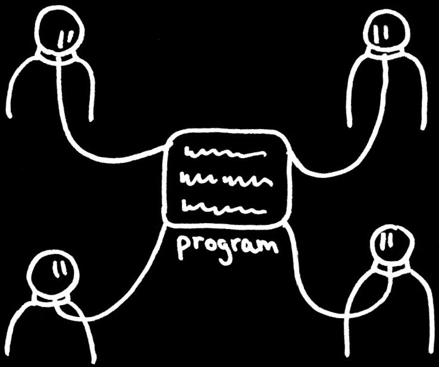
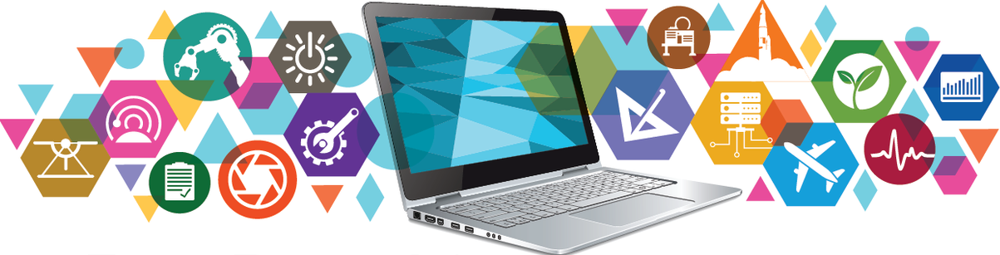
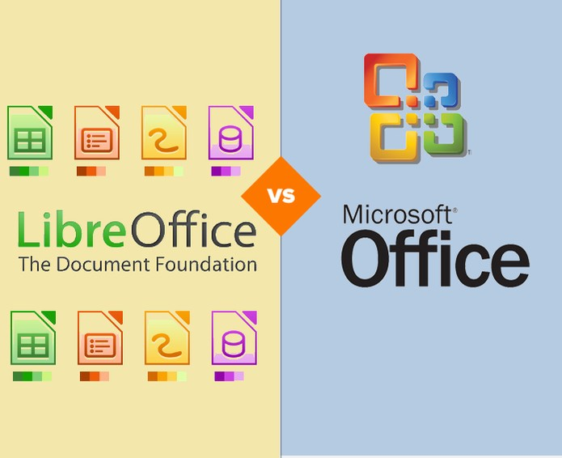
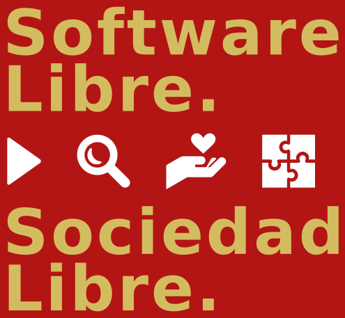

# parte 0

¿Por qué hablar de esto?

* Las máquinas  están en todos lados
* Soberanía Tecnológica

# parte 1

Conceptos

# ¿Qué es el Software?

# Breve historia

* IBM imagina un negocio mundial de unas pocas computadoras al año
* Personal computer (PC) --> Microsoft
* Smart-Phones
* Software como Servicio

# Software Privativo

Software que no respeta la libertad (en algún aspecto)

# Software Libre

# ¿Quién tiene el control?

#

#

# ¡Quién tiene el control!
 

[El software privativo a menudo es malware](https://www.gnu.org/proprietary/proprietary.es.html)
   

una lista de alrededor de 400 ejemplos de funcionalidades maliciosas

# ¿Qué es el Software Libre?

El Software Libre es aquel que respeta la libertad de las usuarias para:

 - **ejecutarlo**
 - **copiarlo/distribuirlo**
 - **estudiarlo**
 - **modificarlo y mejorarlo**

 - y la solidaridad social de tu comunidad

# Libertades

Respeta cuatro libertades esenciales

# Ejecutar

# Estudiar

# Copiar

# Modificar

#

No es una distinción técnica sino **ética, social y política**, por lo tanto, más importante que cualquier distinción técnica

# ¿Qué es el movimiento del software libre?

Promueve que las usuarias de computadoras obtengan la libertad que otorga el software libre.  El software libre permite que las usuarias ejerzan **el control** de sus propias tareas de computación

# Dependencia vs desarrollo

Usar un programa privativo es **dependencia**

Usar un programa libre es **desarrollo**

# Free Software   Software Libre   (Libre ≠ gratis)

El software libre es una cuestión de **libertad**, no de precio. 
Debe pensarse en «libre» como en «libertad de expresión», 
no como en «cerveza gratis»

# Enemigos

El «software libre», como las sociedades libres, tiene sus enemigos

# Parte 2

Derechos reservados

# ¿izquierda o derecha?

# Copyright

#

#

# Copyleft

prohibido girar a la derecha

#

Método general para liberar un programa u otro tipo de trabajo, que requiere que todas las versiones modificadas y extendidas también sean libres
[¿Qué es el copyleft?](https://www.gnu.org/licenses/copyleft.es.html)

# Parte 3

¿Qué hace Libre al Software Libre?

# La licencia

Instrumento que permite implementar el copyleft

# Licencia GPL

La licencia más ampliamente usada en el mundo del software libre
La 1ra diseñada específicamente para **impedir la apropiación privada del software**

# Carácter hereditario

Todo lo que se cree a partir de un programa liberado con GPL tendrá que tener a su vez GPL. Garantiza las 4 libertades

# Licencias para software

Licencias de Software Libre compatibles con la GPL
[https://www.gnu.org/licenses/license-list.es.html](https://www.gnu.org/licenses/license-list.es.html)

# Parte 4

Programas

# ¿Qué es Linux?

# ¿Qué es GNU/Linux?

# GNU/Linux

# ¿Qué es GNU?

[El manifiesto de GNU](https://www.gnu.org/gnu/manifesto.es.html)

#

GNU es un sistema operativo de Software Libre, 
es decir, respeta la libertad de las usuarias

#

Richard Stallman

# Distribuciones GNU/Linux

[DistroWatch](https://www.distrowatch.com/)

# Contrato social de Debian

"[Contrato social](https://www.debian.org/social_contract.es.html)" con la comunidad de software libre

* Debian permanecerá 100% libre
* Contribuiremos a la comunidad de software libre
* No ocultaremos los problemas
* Nuestra prioridad son nuestros usuarios y el software libre
* Trabajos que no siguen nuestros estándares de software libre

# parte 5

# ¿Qué podemos hacer con Software Libre?

#

#

#

#

#

# Chasqui

Chasqui es una herramienta multiplataforma de licencia libre que está especialmente diseñada para promover y gestionar la comercialización electrónica de productos de la Economía Social y Solidaria

[http://proyectochasqui.org/](http://proyectochasqui.org/)

# Estándares

Consensuados, Libres y Abiertos vs de facto

Crear un ambiente favorable para que el Software Libre pueda prosperar

# OpenDocument

Formato de Documento Abierto p/ Aplicaciones de Oficina (ODF)

Std OASIS - Open Document Format for Office Applications -

# Parte 5

La Comunidad

# Conocimiento

* Bien Común
* Colectivo
* Democratización del conocimiento

# El tipo de software que usamos importa

* ¿Qué acceso a la información y al conocimiento y la cultura construimos hoy para las generaciones futuras?

* ¿Cómo podemos asegurar sus derechos en el marco de un desarrollo humano y productivo que considere estos derechos como una de sus dimensiones?

* El software que usamos como posicionamiento **político**

# Desnaturalización de lo dado como irreversible

* Saber que podemos elegir el software que usamos
* reflexionar críticamente sobre la forma productiva en la que nos organizamos
* trabajar en favor de una transformación hacia un mejor mundo futuro

# ¿de quién es el conocimiento?

#

El Software Libre se convirtió en una forma de **producción y distribución del conocimiento** completamente diferente a la que genera la industria capitalista, proponiendo la libertad en el uso y apropiación del conocimiento

# Valores y principios

Valores y principios compartidos entre la Economía Social y la producción de Software Libre

# Acceso

El acceso al conocimiento y la tecnología favorece círculos virtuosos de transformación social

# Ética

*"El Software Libre no es un asunto técnico, es un asunto ético del uso de las tecnologías, porque el Software Libre respeta la libertad de las usuarias y la solidaridad social de su comunidad"* RMS

#

#

# referencias

videos, entrevistas, libros, notas

#

[El derecho a leer (RMS)](https://www.gnu.org/philosophy/right-to-read.es.html) / [Pantallas, derechos, cultura](http://publicaciones.filo.uba.ar/sites/publicaciones.filo.uba.ar/files/Pantallas,%20derechos,%20cultura%20y%20conocimiento.pdf)

[Software libre para una sociedad libre (RMS)](https://www.gnu.org/philosophy/fsfs/free_software.es.pdf)

[Software Libre y Cultura Libre (La Imilla Hacker)](https://eldesarmador.org/14-software-libre-y-cultura-libre.html)

[P/12: Tecnología nacional y desarrollo asociado](https://www.pagina12.com.ar/40391-la-familia-unida)

[Códigos Cooperativos](https://youtu.be/sMI1HA9mOmc) / [Guía Práctica sobre SL (UNESCO)](https://www.vialibre.org.ar/wp-content/uploads/2007/11/gsl.pdf)

[Video de Richard Stallman para el FLISOL 2009](https://vimeo.com/4152803)

[A qué le llamamos SL (Beatriz Busaniche)](https://youtu.be/h0tXtRRW564)

[En el medio digital: Software Libre (Canal Encuentro)](https://youtu.be/NrFbtRV-rOA)

[Manual de tecnologías abiertas para la gestión de organizaciones de la Economía Social y Solidaria](https://www.gcoop.coop/manual-tecnologias-abiertas)

[El Software Libre como herramienta](https://www.argentina.gob.ar/noticias/el-software-libre-como-herramienta) / [Chasqui](http://proyectochasqui.org)

#

#

#

[https://pewen.github.io/charlas.sl/apicultura](https://pewen.github.io/charlas.sl/apicultura)
